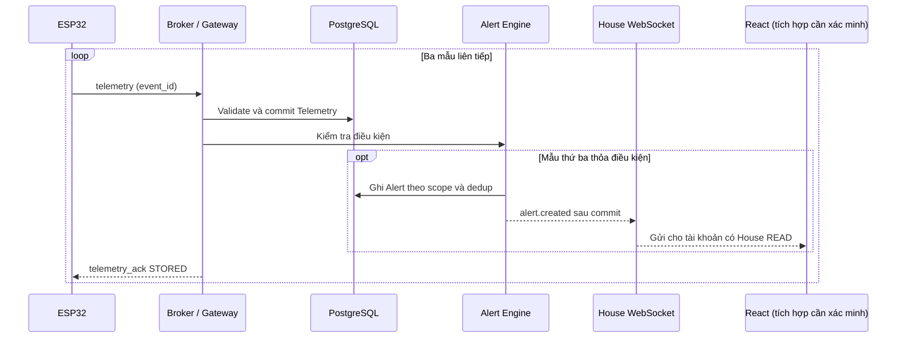
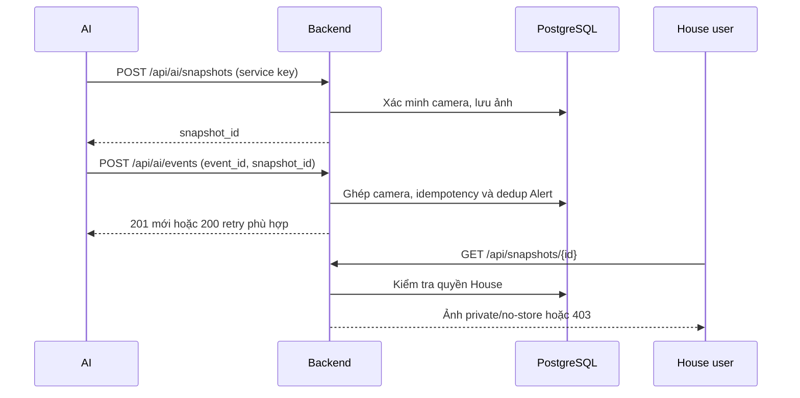

# Sequence Build 3

```mermaid
sequenceDiagram
    participant ESP as ESP32
    participant GW as Broker / Gateway
    participant DB as PostgreSQL
    participant E as Alert Engine
    participant WS as House WebSocket
    participant UI as React (tích hợp cần xác minh)
    loop Ba mẫu liên tiếp
      ESP->>GW: telemetry (event_id)
      GW->>DB: Validate và commit Telemetry
      GW->>E: Kiểm tra điều kiện
      opt Mẫu thứ ba thỏa điều kiện
        E->>DB: Ghi Alert theo scope và dedup
        E-->>WS: alert.created sau commit
        WS-->>UI: Gửi cho tài khoản có House READ
      end
      GW-->>ESP: telemetry_ack STORED
    end
```

```mermaid
sequenceDiagram
    participant AI
    participant A as Backend
    participant DB as PostgreSQL
    participant U as House user
    AI->>A: POST /api/ai/snapshots (service key)
    A->>DB: Xác minh camera, lưu ảnh
    A-->>AI: snapshot_id
    AI->>A: POST /api/ai/events (event_id, snapshot_id)
    A->>DB: Ghép camera, idempotency và dedup Alert
    A-->>AI: 201 mới hoặc 200 retry phù hợp
    U->>A: GET /api/snapshots/{id}
    A->>DB: Kiểm tra quyền House
    A-->>U: Ảnh private/no-store hoặc 403
```
